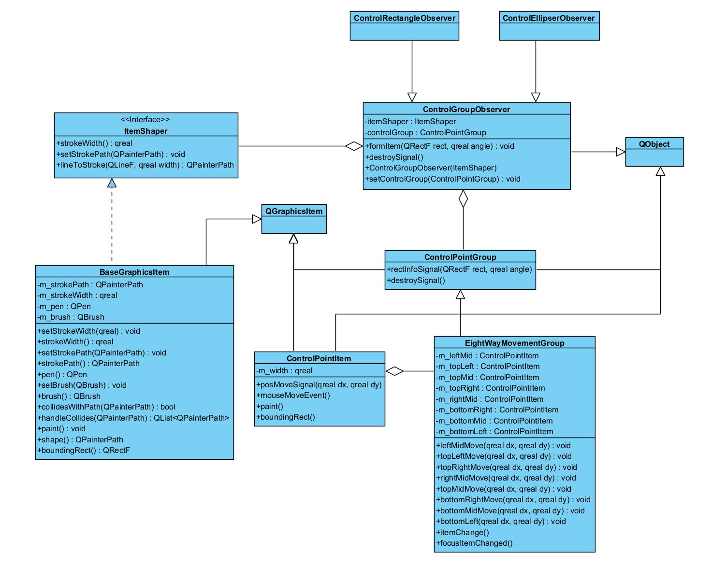
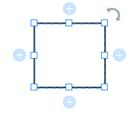

# Item层次结构设计

# Item层次

针对我们白板软件的Item行为和Qt中提供的Item的行为有偏差，我对Qt中的Item的行为进行了研究，并形成了一套适用于白板的Item的行为抽象。

## 白板的Item中的抽象概念

Item中的抽象概念

## Item的类层次结构

最终，我设计出了如下的UML类图结构，用来抽象表示Item层次：

​​

下面我来详细解释一下各个类对象的功能和作用分别是什么。

### BaseGraphicsItem

​`BaseGraphicsItem`​继承了`QGraphicsItem`​类，并实现了`ItemShaper`​接口。

​`QGraphicsItem`​我们都很熟悉，但问题是`ItemShaper`​是什么呢？顾名思义，就是用来塑造`BaseGraphicsItem`​笔画形状的一个接口。这个接口存在的目的在于：让使用该接口的对象能获取我们希望他遵循的数据信息，比如：笔画的宽度，以及设置笔画形状的方法`setStrokePath()`​；同时，我们提供了一些他可能会使用到的、用于辅助其开发的`lineToStroke()`​方法。

这就把收集坐标信息，并通过特定算法形成形状的任务交给了通过`ItemShaper`​引用`BaseGraphicsItem`​的类对象。`BaseGraphicsItem`​只需要关注如何处理笔画本身，而不是把所有的坐标处理、形成形状的算法都集成在`BaseGraphicsItem`​中。

### ControlGroupObserver

​`ControlGroupObserver`​类对象负责在`ItemShaper`​给定的约束条件下，利用`ControlPointGroup`​形成的矩形信息，通过一些算法处理，形成一个特定的形状。这个特定形状的构成由不同的子类来实现，比如`ControlRectangleObserver`​复杂将收到的rect信息形成一个rect填充区域并将该区域对`ItemShaper`​进行塑造。

这个塑造的过程直到`ControlPointGroup`​发出`destroySignal()`​结束，这时的`ControlGroupObserver`​的使命也结束了，需要发送`destroySigal()`​向外界请求删除自己。

---

​`ControlPointGroup`​是用来在矩形形成一定形状后，`ControlGroupObserver`​利用它进行形状的调整。

但再次之前，我们利用鼠标事件从`mousePressEvent()`​中采集到第一个点，然后从`mouseMoveEvent()`​采集到与第一个点不同的其他点，以此形成了不同的矩形。这时候，我们并不需要控制点组进行形状控制。

等到用户释放鼠标，我们才需要使用`ControlPointGroup`​为用户提供微调的功能。

因此，`ControlGroupObserver`​的调整分为两个阶段，第一个阶段由`Scene`​在事件函数中传递矩形信息；第二阶段，设置上控制点组并由控制点组通过信号完成调整操作，此过程中不需要Scene的参与。

### ControlPointGroup

​`ControlPointGroup`​类对象搭建了一套控制点，通过该控制点形成一个矩形形状rect，并且将rect通过信号的方式实时同步修改。

​`ControlPointGroup`​并不需要管接收该信号的对象使用rect的信息用来干什么，它只需要关注如何形成一套合理的控制点移动逻辑，让rect可以正确地形成。

---

​`EightWayMovementGroup`​代表的是我们可以通过继承`ControlPointGroup`​实现不同移动逻辑的控制点组，因为不同的Item需要不同的控制点组来进行形状的控制。如果你给`ControlSquareObserver`​（假设有）一个矩形框，但它必须塑造一个正方形，它使用矩形坐标（如果你希望那确实可以）形成正方形，但是最终`BaseGraphicsItem`​显示出来的正方形大概率会和控制点的位置不一致。因此，单纯地拥有正方形的形成算法是不够的，你必须有一个特殊的控制点移动逻辑才能做到`BaseGraphicsItem`​形状与控制点位置对应的效果。

只要我们规定好了控制点形成的形状每时每刻都是正方形，那么就可以直接利用`ControlRectangleItem`​来形成正方形。

**我们要明确的点就是**：`BaseGraphicsItem`​的形状不是通过`ControlGroupObserver`​来形成的，它塑造`BaseGraphicsItem`​的原始信息来自`ControlPointGroup`​，想要规定好`BaseGraphicsItem`​的形状，最终需要以`ControlPointGroup`​为抓手。

---

‍

> 在我一开始实现控制点组控制矩形Item的形状绘画的时候，我将控制点组集成到了矩形Item中，我发现这样子做非常不合理，比如：如果`SquareItem`​继承了矩形Item，那么矩形Item的控制点组的移动逻辑其实不适用于`SquareItem`​。但矩形Item的控制点移动逻辑却和`EllipseItem`​是相同的。因此，我意识到，控制点的移动逻辑不应该集成到Item中，它应该是一个可插拔的对象。

当`ControlPointGroup`​父项或者子项都失去焦点时，它就会发出`destroySignal()`​通知外界删除自己。

### EightWayMovementGroup

​`EightWayMovementGroup`​类，我把它叫做“八向移动”类对象，这“八向”指的是：左、左上、上、右上、右、右下、下、左下。

通过规定这八个点的移动逻辑，形成一个任意形状的矩形（下图采用ProcessOn进行演示）：

​​

> 上面的旋转功能先不用管，我们先不考虑旋转功能，等到实现基本的八向移动器之后，再考虑扩展旋转功能。

想要达成类似于上面那样的功能，我们首先需要定义好控制点之间的移动逻辑。那好，什么叫控制点的移动逻辑？

控制点在检测到鼠标对其进行移动操作后，它并不会自己改变自己的位置，而是将自己鼠标对自己的移动通知给父Item。

由于父Item（这里假定为`EightWayMovementGroup`​）管理着多个控制点，不同的控制点之间有不同的含义，一个控制点的移动可能会影响其他控制点的移动，所以不能够让控制点自己随意移动，而是将移动的变化向量告诉给父Item，让父Item来进行判断怎样移动。

比如：左上的点在x轴上往左移动了`dx`​，且在y轴上移动了`dy`​。那么左下的点需要跟着左上在x轴上移动`dx`​，而右上的点需要跟着左上的点在y轴上移动`dy`​，最后矩形所有的边的中点都需要根据左上、左下、右上的移动，重新计算它们所在的边上的中点位置。

## 探索过程

Item的层次的解决方案的探索过程：

1. 利用Qt中的线来表示白板中的线。
2. 试图制造有宽度的点对象，将多个点Item组合形成一个Item。即，我们将笔划切割成一个极小的组成部分，以实现精确擦除功能，但是这样做的时候绘图的逻辑复杂，且处理的计算复杂度高。并且这个极小的组成部分的管理逻辑不好把控。用点组成线的粒度不好把控，按照数学逻辑来说需要定义无数个点才能形成一条线，并且点和点之间可能会存在渲染冲突（特别是渲染激光笔的时候的冲突，外围的阴影效果非常不好实现）。
3. 将笔画抽象成填充区域，利用Qt提供的处理填充区域的接口实现精确擦除功能，让可以将单个笔画看做整体来处理（而不是由极多的小部分组成的），降低了计算的复杂度。但绘图逻辑仍然需要设计，但相较于第2种，复杂度是降低了的。

我们还考虑到撤销操作的实现（Memento设计模式）：

* 对于第2种来说，我们可以记录多出来什么item，少了什么item都可以当做是`Scene/Item`​状态改变的一部分，通过管理这些状态可以实现撤销操作。但是由于原子粒度是一个对象，它本身占据空间来组成一个大Item，所以必然需要巨量的这些Item，这即需要存储的控件，又需要处理的时间。
* 对于第3种来说，我们也是通过记录Scene中Item的状态改变。

  * 在空间方面，我们利用Qt的接口处理不同的填充区域，如果我们添加一个笔画，那就只是添加了一个填充区域Item，而并非由非常多的Item组成的一条笔画；而如果我们擦除笔划，那么造成的笔画分离也不会产出太多了填充区域，这对空间是极大的减负。
  * 而在处理速度方面，一方面我们处理一个笔画不再需要处理笔画里大量的点Item，只是进行填充区域间的运算；另一方面，由于单个笔画Item对象得到了简化，所以处理速度得到加快

从原理上来说，第2种方案和第3种方案实现撤销的原理是一样的。但第2种方案由于要处理笔画Item本身的复杂性导致其时间和空间复杂度都高，而第3种方案通过优化笔画的实现，减小了时间和空间的复杂度。

整个层次的所有代码实现预估大概1500行。

## 思路总结

在我为了实现画曲线效果的时候，我确实详细学习过`QPainterPath`​的每一个接口的功能。

在我实验`QPainterPath`​的时候，我发现它规定只有填充区域之间才能够进行一系列的相交等操作，它无法对直线与直线之间，直线与填充区域之间进行相交操作。于是我认为，无法通过`QPainterPath`​的接口完成擦除功能，因为它没有办法检测线与擦除区域之间的相交。

后来，我实践了第二种方法，发现这样完成的笔画线及其复杂，时间和空间复杂度都极其高。于是，从性能角度来看，我认为这种方式实现可擦除的笔画Item不可取。

这对我打击很大，花了2、3天找出的解决方案没有得到应有的成果，我暂时没有想到第3种方案，但提出第2中方法的改进方案：

1. 通过缩小点Item的粒度来减少性能损耗。
2. 通过优化算法来优化性能。

我考虑到画曲线的优化可能会运用到贝赛尔曲线去优化算法，所以用`QPainterPath`​去看看怎样运用贝塞尔曲线。

机缘巧合之下，我重新试了试用直线和填充区域相交的实验，发现依然行不通，只有填充区域之间才能相交。那时的我已经通过实验第2种解决方案明白了一件事：用来组成线的点存在宽度，那么这条线肯定也是有宽度的！线具有填充区域！但实际情况确是：线和填充区域之间却不能够相交，这是为什么？

而探索这个问题的答案，得出的结论就是上面的第3种解决方案。

发现一个细小的差别，然后探索原因，最终得出一个答案：因为Qt的线是数学意义上的线，无法与任何填充区域相交，而我理想中的线却有与填充区域相交的能力，因此我理想中的线并非数学意义上的线！一开始没有意识到这一点是因为我认为白板软件想要的线是一种数学意义上的线，但实际上它不是一种数学意义上的线！

归根接地，是现实世界到软件世界的概念映射没有真正意义上的完成，所以导致一开始没有思路。后面通过实践发现，白板软件的线跟数学意义上的线是有差别的，但被Qt渲染的时候掩盖了（能画出来说明有面积，但Qt的底层处理中线并没有面积，它的呈现状态和它底层的情况有差别！），让我忽略了一个点：数学上的线不应该有面积，因此又误导我认为Qt中的线有面积（但实际上Qt中的线没有面积）。

总结一开始没有想到好的解决方案的原因：

1. 认为白板软件中线没有面积（需求分析错误）。
2. Qt中渲染的线状态和实际底层处理线的逻辑存在矛盾，但我没有深入研究“线不能和填充区域相交”这样现象的原因。这里其实是需求分析不够彻底甚至是错误导致的，因为没有对白板软件的线进行明确的定义和需求分析，所以不知道白板软件想要的线是什么就擅自任务它是数学意义上的线，而Qt中对线不能与填充区域相交是符合数学定义的，于是我没有认为该现象错误（不符合需求），因为我没有意识到自己认知的线和白板软件需要线是完全不同的两个东西。

> 预测完成基本功能需要大约1000行代码。
>
> 具体的实现可能和设计有所偏差，这是由于设计是前面完成的而采进行编码，并且从编码测试中又会得到修改，而这写修改能不能反映到上述文档中我不敢保证。只有没有设计上的重大变化，基本上不会对设计文档进行修改。
>
> * 2024-09-06：使用**560**行代码完成`BaseGraphicsItem`​ `ItemShaper`​ `ControlPointItem`​ `ControlPointGroup`​ `EightWayMovementGroup`​ `ControlGroupObserver`​ `ControlRectangleObserver`​。

‍
