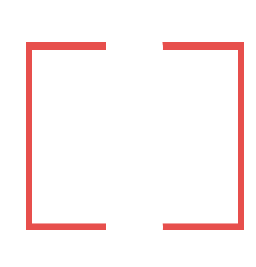

# Item中的抽象概念

数学意义上来说，一条线其实并没有宽度的概念，它是由无数的点连接而成的。而面积，是由无数的线所构成的。

在现实中却并非如此，无论你用什么笔，点都会具有面积。这就意味着我们的线也有面积。这就意味着，我们的白板上的笔所留下来的痕迹也需要“模拟”这一特性。

比如说，我们画矩形的时候，矩形的边并非是由一条线组成，而是另一个有着面积的矩形构成的，只不过这个矩形的宽非常窄。就像下面这样：

​​

只是我平常没有注意到，下意识地认为自己所连的一条线，真的就是数学意义上的线。因此，我们使用Qt中有关连线的接口，所画出来的线Line，也不是我们所想要的“线”。我们所想要的线，应该是Qt所称的填充区域的东西！

我们所要完成的笔画，其实就是一种填充区域，这个填充区域模仿了现实中的笔画。比如，我们想要在程序中画一条直线，它并不是一条直线，而是经过看起来像是直线的填充区域，就像下面这张图所示：

​​

因为其宽度足够小，所以人在感官上就觉得这是一条直线，但实际上不是，它是一个有面积的填充区域。

### 这样抽象的好处是什么？

假如，我们将Qt中所提供的线，当做我们所想要模拟的现实中的“线”，情况怎么样？

Qt中的线，完全是按照数学中的定义来进行处理的。

这样做的话，假如我们有一条Qt中的线line，和一个橡皮擦所覆盖的区域S。我们规定：与橡皮擦S碰撞的所有线的部分，都必须被擦除。

line与S确实发生了碰撞，然后我们试图使用S(用QPainterPath表示)的`intersected(line)`​来获取碰撞的区域，你什么也不会得到，因为Qt中碰撞产生的基础是碰撞的双方必须具有面积，而line没有面积，因此它不会和任何东西产生碰撞！这就与我们现实中的抽象产生了冲突，在我们的认知中line和S它们确实发生了碰撞。

这个问题产生的根本原因就在于，数学意义上的“线”它没有面积，它本不应该有任何现实意义的呈现方式。但是Qt为了表现出线是一条线，它在渲染的时候给线添加了宽度，让我们擅自认为Qt所渲染的线，其实和现实中的线一样是有宽度的，但其实并非如此。

> Qt中渲染的线的宽度并非是线本身的概念，而是渲染它的`QPen`​所赋予的。

### 笔画的行为逻辑

正是因为Qt中的线无法模拟现实中的线，所以我们必须要自定义自己的线用来模拟现实中的笔所画的线。

以矩形为例，我们的矩形，并不是由Qt中的线概念形成的矩形，也就是`QRect`​并不能表示我们想要的矩形（QRect认为由矩形围起来的区域都是矩形本身）。

​​

我们的矩形仅包括模拟的线的填充区域本身。也就是这张图的红色区域。

​​

这两者是完全不同的概念，举个例子：对于`QRect`​来说，S（橡皮擦）只要和矩形内部有相交区域，那么就可以被当做出现了碰撞；然而，对于我们的矩形来说，S可以和红色框内部的区域相交，且不认为这是碰撞。这对我们简化了我们处理橡皮擦碰撞的处理逻辑，你不用再担心橡皮擦有没有真正碰撞到矩形的边框了（这个边框的宽度会随着`QPen`​而变动，且无法通过Qt中给定的碰撞接口来获取）。

那么我们的矩形在遇到擦除的时候该怎么处理呢？假设矩形名为`myRect`​（用QPainterPath表示），橡皮擦区域为为S（用`QPainterPath`​表示），你就可以直接调用  
​`remain = myRect.subtracted(S);`​就可以将剩余的矩形轨迹获取出来存放到`remain`​中。剩余的矩形区域可能是什么样的呢？可以是这样的：

​​

​​

擦除之后就不再是矩形了，那用什么表示呢？

我想出了这样一种抽象：

其实不论是矩形，还是圆形，都是使用笔所画出来的填充区域，擦除之后依旧可以认为是一个笔画。而矩形只是使用特殊的笔画顺序所生成的一个整体而已。同时，这个整体在初始化时因碰撞而连接，在初始化完成之后不会因为碰撞而连接（这个初始化阶段类比于我们下笔到笔离开纸的过程），当我们再次下笔，那么新形成的笔画不应该和原来在纸上的笔画有任何形式的联系。

同时，笔画在形成后不会因新笔画的碰撞而连接，但却有可能因为与橡皮擦碰撞而分离。橡皮擦的碰撞不一定导致笔画的分离，比如：

​​

但有的时候，擦除会使得一个笔画分离，比如：

​​

这样的情况下，一个笔画就被分成了两个笔画，我们应该将这原本是一个笔画的部分分成两个笔画。这样做的技术难度也不大，就是使用`QPainterPath::toFillPolygons()`​将返回的填充区域都封装成一个新笔画，然后自己再消失就行了。这样笔画之间的关系就被分离，每个笔画可以被单独移动、擦除。

### 控制点

我们注意到有这么一个需求：需要有调整矩形、椭圆等形状的方案。

于是我们可能想到这样一种解决方法：在矩形上添加一些调整矩形形状的控制点，让用户调整矩形的形状。其效果可能类似于这样：

​​

我们是否需要将这些控制点看做矩形的一部分？我认为答案是：不需要。

控制点只是我们收集画矩形的笔画顺序的一个手段，它不是矩形本身，完全没有必要将这么一套复杂的处理逻辑引入矩形。

因此，笔画和控制点组（一套控制点）必须使用某种设计模式进行解耦合！

> 在Qt中，有现成的解耦合方式：信号和槽。控制点组实时发送信号给矩形笔画形成对象，让后者实时调整状态。
>
> 在控制点组失去焦点时，将信号发送给Scene，让Scene把该控制点组删除。

---

接下来的问题就是，我们如何实现控制点组？

我实际使用了ProcessOn的经验告诉我，8个控制点组成一个矩形 + 旋转功能，这样的形态就可以应对绝大部分的形状渲染

​​

没有添加旋转功能的8控制点移动的逻辑我已经实现过来，但是加入旋转功能后的移动逻辑显然更加复杂。

因此，这需要对旋转功能有一定了解，且对数学运算也有一定的要求（引入斜率和简单的直线运算）。

> 具体如何将点击旋转控制点后的移动逻辑和旋转结合起来，还需要进一步学习。
>
> 如何利用旋转后的点进行正确的绘图，这也是一个问题（目前我想到的解决方案是：不是使用旋转后的点进行运算，而是将旋转后的点旋转会正常模式，然后渲染，最后再旋转回来，完成渲染）

## 填充区域处理

‍

### 线的填充区域化

对于任意给定的两个点，我们需要将这两个点所连的线进行填充区域化，其效果大概是这样的：

​​

单纯的水平的线并不难画，这里的难点在于：我们应该如何处理斜线的填充区域。这里探索了两种方案：

1. 用强大的数值分析能力，把所有需要用来绘制填充区域的点的坐标计算出来，然后进行绘制。
2. 利用Qt原本的接口来完成，而不需要使用任何数学计算。

第1种太过复杂，而且计算出来的效果经常不尽人意的。那只能是利用第2种方法来解决，对Qt相关接口熟悉的应该能很快解决方案，但我一开始没有想到，经过学习才想到。

第2种解决方法，可以分以下步骤：

1. 将斜线放平。（如何放平呢？我的解决方案是记录起始点的坐标，然后利用两点的距离将末尾点的水平位置计算出来，反正最后能旋转回来的）
2. 圈出来左边的圆形区域、中间的矩形区域、右边的圆形区域。
3. 将以上的三个区域合并（使用`QPainterPath::united()`​）。
4. 将合并后的区域使用`QTransform::rotateRadians()`​进行旋转操作。

这里的关键其实在于我们如何进行旋转，接下来详细介绍。

### 旋转水平的填充区域

​​

​`QLineF`​中的线其实是有方向的，判断它的角度的时候就会将其当做一个向量。在这里，我们将不同方向的斜线都放平成水平指向右边的直线。

然后利用这个直线完成填充区域的圈定，最后再通过旋转将其旋转回原来的角度。

我们其实可以在放平斜线后，完成填充区域，再使用`QLineF::angle()`​提供的角度和`QTransform::rotateRadians()`​的旋转矩阵将填充区域重新旋转回来。

> 注意`QTransform::rotateRadians()`​指定的旋转角度是顺时针的旋转角度，还有，旋转中心点必须指定为`QLineF`​的起始点，否则会出现错位。

以上的逻辑只是用来将线转换成填充区域的方法，后续有些形状，比如：矩形、正方形可能会需要。但椭圆，圆形可能有特殊的处理逻辑。

完成后续设计时可以参考：

```C++
QPainterPath lineToStroke(const QLineF& line, qreal width) // 将线QLine转换成填充区域(用QPainterPath表示)
{
    // 处理
    QPointF startPoint;
    // 保证startPoint存储左边的点
    startPoint.setX(line.x1());
    startPoint.setY(line.y1());

    QTransform transform;
    transform.translate(startPoint.x(), startPoint.y());
    transform.rotateRadians(qDegreesToRadians(-line.angle()));
    transform.translate(-startPoint.x(), -startPoint.y());

    qreal distance = qSqrt(qPow(line.x1() - line.x2(), 2) + qPow(line.y1() - line.y2(), 2));
    QPointF endPoint(startPoint.x() + distance, startPoint.y());
    QRectF rect(QPointF(startPoint.x(), startPoint.y() - width / 2), QPointF(endPoint.x(), endPoint.y() + width / 2));

    QPainterPath tempPath;
    tempPath.addRect(rect);
    QPainterPath ellipsePath1;
    ellipsePath1.addEllipse(QRectF(startPoint.x() - width / 2, startPoint.y() - width / 2, width , width));
    QPainterPath ellipsePath2;
    ellipsePath2.addEllipse(QRectF(endPoint.x() - width / 2, endPoint.y() - width / 2, width , width));

    tempPath = tempPath.united(ellipsePath1);
    tempPath = tempPath.united(ellipsePath2);

    return transform.map(tempPath);
}
```
