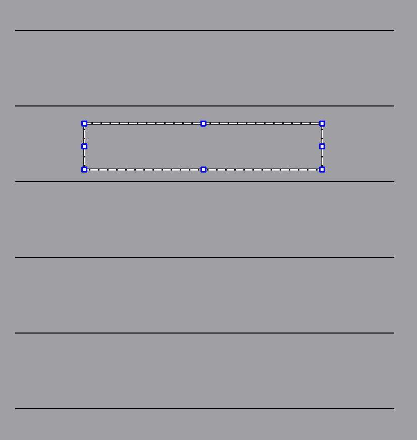

# Scene层次结构设计

# Scene层次

Scene层次主要是检测事件，并且应该做到不同工具下，对某个事件进行不同的处理。

因此，工具集成类型集成于该层次，对不同工具触发的事件进行反应，让外界可以设置不同工具等等有关工具的内容都是在`Scene`​中实现的。

## 工具的实现

对于钢笔、荧光笔、激光笔、橡皮擦这些工具，首先我们需要有一个变量标识当前的`Scene`​正在使用什么工具。

​`Scene`​在处理某些事件的时候，会根据不同的工具，完成不同的操作，这些不同的操作中，对应钢笔的操作需要使用到钢笔的属性、对应荧光笔的操作需要用到一些荧光笔的属性。因此，我们需要将钢笔、荧光笔、激光笔、橡皮擦这些工具的属性封装起来，并且这些属性能够被记录下来，还能够在打开软件的时候读取这些记录下来的属性，所以关键在于：

1. 将工具的属性封装成类对象。
2. 类对象的属性能够保存在用户本地。
3. 保存在用户本地的类对象属性必须能够在打开白板时重新得到加载。

这里涉及到配置系统的实现，需要将应用程序的一些信息保存到本地中，并在应用程序在第一次安装使用时，提供默认的工具属性。

## Scene的背景

Scene的背景是一个图元，假设该图元的名字为`BackgroundItem`​，该`BackgroundItem`​需要在Scene构造时给定（也可以不给定，但这时我们需要给出默认实现）。

Scene的大小必须时时刻刻和`BackgroundItem`​的大小保持一致，并且`BackgroundItem`​必须永远处于所有其他图元的下层。`BackgroundItem`​不可以被移动，也不能用橡皮擦擦除。导入的PDF文档页面将作为`BackgroundItem`​。我想出了两种不同的`BackgroundItem`​的组成方式：

* 使用预制好的`QPainterPath`​来绘制`BackgroundItem`​，这样用户可以自定义`BackgroundItem`​的颜色，而不影响需要绘制的轨迹。
* 使用`QImage`​作为`BackgroundItem`​，这样的话填充颜色就没有了作用，用户不再能够自定义`BackgroundItem`​的颜色。

也就是说，`BackgroundItem`​可能会有两种实现，一种以`QPainterPath`​为绘制的基石，另一种以`QImage`​为绘制的基石。

## 对事件的处理逻辑

由于我们后续可能将白板软件移植到平板上，所以需要处理触摸事件，而触摸事件和鼠标事件是有差异的。

所以，我们对鼠标事件的处理方式是，将我们需要的信息抽象出来，这个信息无论是鼠标还是触摸都能收集到，通过这种方式将处理信息的业务逻辑集中到一处中。

> 各种工具创建的时候，必须考虑到工具本身的特性，比如：钢笔绘制的时候需要使用到没有透明度且有一定颜色的`BaseGraphicsItem`​；荧光笔需要有透明度和颜色，除此之外，还要有直线绘制和曲线绘制两种模式；激光笔内部是白色而外围需要使用渐变的color来绘制，且一定时间后会消失。

### mousePressEvent()

对于`mousePressEvent()`​，我们需要的信息就是：鼠标按下的位置`pos`​。

#### 钢笔

利用`pos`​创建出一个以`pos`​为起点和终点的直线的填充区域图元`path`​（类型为`BaseGraphicsItem`​使用`ControlGroupObserver`​的某个子类进行塑形）。

#### 荧光笔

曲线绘制模式：

利用`pos`​创建出一个以`pos`​为起点和终点的直线的填充区域图元`path`​（类型为`BaseGraphicsItem`​使用`ControlGroupObserver`​的某个子类进行塑形）。

---

直线绘制模式：

记录下初始`pressPos = pos`​，交由后续的事件使用

#### 激光笔

利用`pos`​创建出一个以`pos`​为起点和终点的直线的填充区域图元`path`​（类型为`BaseGraphicsItem`​使用`ControlGroupObserver`​的某个子类进行塑形）。

#### 橡皮擦

在`pos`​创建一个橡皮擦图元并记录下来。并把橡皮擦擦除的图元收集起来，在这时候这些图元都只是被擦除一部分，但即使它们因擦除而分离，此刻分离的部分已经同属于一个图形项，它们并不独立。

### mouseMoveEvent()

对于`mouseMoveEvent`​，我们需要的信息就是：鼠标上次所在位置`lastPos`​，和当前位置`pos`​。

#### 钢笔

利用`lastPos`​和`pos`​，结合press事件中创建的`ContrlGroupObserver`​子类，完成现有`path`​和新添加的`path`​之间的融合。

#### 荧光笔

曲线绘制模式：

利用`lastPos`​和`pos`​，结合press事件中创建的`ContrlGroupObserver`​子类，完成现有`path`​和新添加的`path`​之间的融合。

---

直线绘制模式：

利用`pressPos`​（press事件中记录的位置）和当前位置`pos`​，画出一条直线填充区域图元`BaseGraphicsItem`​，这个填充区域图元随着`pos`​的变化而变化，但`pressPos`​是不变的。

#### 激光笔

利用`lastPos`​和`pos`​，结合press事件中创建的`ContrlGroupObserver`​子类，完成现有`path`​和新添加的`path`​之间的融合。过了一段时间后，激光笔会消失在屏幕上，如果一定时间内再次进行激光笔按压、移动，那么消失的时间将会被重置，直至有一次倒计时完成，所有激光笔笔画都会释放。

#### 橡皮擦

将press创建的图形项移动到`pos`​。将被碰撞擦除的图形项收集起来。

### mouseReleaseEvent()

鼠标的释放事件意味着图形项的形成结束了。

释放时，需要将新增的图元记录下来，同时产出一个`Memento`​，记录`Redo`​和`Undo`​以为后续的撤销和还原功能打下基础。Qt中有完成好的`QUndoStack`​和`QUndoCommand`​给我们利用，可以继承`QUndoCommand`​实现自己的Redo和Undo操作，然后让`QUndoStack`​来进行管理。

#### 钢笔

结束信息采集，将相应的变量重置。

#### 荧光笔

结束信息采集，将相应的变量重置。

#### 激光笔

结束信息采集，将相应的变量重置。

#### 橡皮擦

将收集的被擦除了部分的图形项，进行分解使其分离的部分独立，而原来的图元将被删除。

* Undo操作，将所以擦除涉及的图形项的状态（填充区域、颜色、以及各种QGraphicsItem的属性复制下来保存），重新创建一个新的`BaseGraphicsItem`​与其对应，并将原来分裂的图形项全部从Scene中删除。
* Redo操作，将因Undo而合并的图形项全部删除，然后将分裂的图形项重新添加到Scene中。

最后，将橡皮擦删除。

## Scene的类层次结构

​​

完成了`Scene`​层次的概要设计，明确了后续的开发方向：

1. 完成Scene的背景`BackgroundItem`​及其子类。
2. 完成`WhiteBoardPen`​ `WhiteBoardHighlightPen`​ `WhiteBoardLaserPen`​ `WhiteBoardEraser`​一系列工具的属性，为后续开发奠定基础。
3. 完成`QUndoCommand`​衍生出适合本项目的子类，为后续的事件逻辑处理打下基础。该方向涉及到和Item层次以及`Scene`​的交互，所以需要慎重考虑其实现。这个过程也会逼着你去思考业务逻辑应该是怎样的，然后你才能在业务逻辑上嵌入这些Undo命令的创建。

    这里需要`BaseGraphicsItem`​有产出自己状态的能力，具体如何设计需要借助Memento设计模式的思想。
4. 完成`WhiteBoardScene`​事件业务逻辑的开发。本阶段的任务最复杂，需要前期进行算法的详细考虑之后，再开始开发，防止准备不足而导致的频繁修改导致Scene结构的代码混乱。

> 在这过程中，需要对`Item`​层次的设计进行修改和查漏补缺。

### BackgroundItem的设计

在Scene中，`BackgroundItem`​只有一个。

​`BackgroundItem`​具有背景颜色，而与这个`BackgroundItem`​是`QImage`​还是`QPainterPath`​无关。这个背景颜色是交由`QGraphicsScene`​来渲染的，`BackgroundItem`​只是指明了这个颜色，只要`BackgroundItem`​被加入`QGraphicsScene`​中，就会立即将Scene的颜色设置成自己所存储的颜色。包括后续`Background`​的颜色发生变化，这种变化会同时反应在Scene上。

​​

​`BackgroundItem`​的会拥有一个默认的矩形大小，而子类来决定是否更改这个大小。同时，在`BackgroundItem`​被添加到Scene中的那一刻，`BackgroundItem`​会立即将自身的大小反应到Scene上，让Scene刚好包括`BackgroundItem`​。`BackgroundItem`​的大小通常在初始化时指定，后续不可再变。

* ​`PathBackgroundItem`​：在`BackgroundItem`​的基础上，绘制一些基础的线，这些线可能是一条条平行线，也可能是纵横交错的线等等。
* ​`ImageBackgroundItem`​：在`BackgroundItem`​的基础上，更改其大小为`QImage`​的大小。

​`PathBackgroundItem`​类似于这种效果：

​​

​`ImageBackgroundItem`​类似于这种效果，它随着背景图片的不同而不同：

​​

## 总结

估计完成Scene层次需要1500行代码左右。

‍
