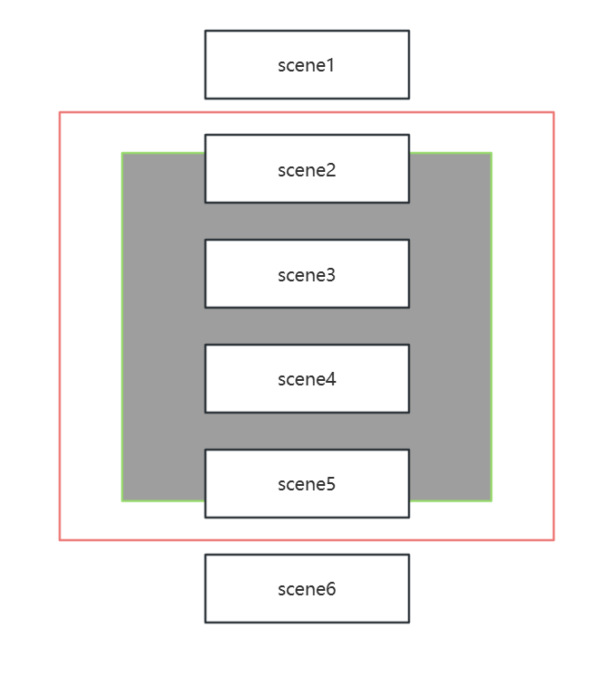

# View层次结构设计

# View层次

在`View`​层次中，我们将多个`Scene`​组合成一个`SceneDocument`​，然后封装两个工具`ScenePageRenderer`​和`ScenePageNavigator`​用来实现`WhiteBoardViewer`​。之所以这样做，是因为我查看了`QPdfView`​的实现源码，发现白板的查看器和`QPdfView`​相类似，所以模拟后者的解决方案。

​​

首先，我们需要将多个`scene`​完成虚拟布局，形成一个竖直连续的序列，中间有一个固定的距离。

然后，我们在虚拟布局中移动视口（即红色区域包围的区域）。由于会有`sceneMargins`​，所以真正展示的区域是灰色的区域。

通过坐标计算，我们知道哪些`scene`​和灰色区域相交，然后在视口上渲染对应的区域，这就是我们的`View`​要完成的工作。

我们可以通过制定视口移动的策略达成单页和多页展示的功能。并且通过管理缩放因子，达成缩放页面的功能。

只不过其中还有许多细节需要注意，这些内容将在详细设计阶段进行完善。

我们在完成`WhiteBoardViewer`​之前，还需要完成`SceneDocument`​ `ScenePageRenderer`​ `ScenePageNavigator`​这些对象，这工作量也是不小的。至少有个2000~3000行代码。

> 平板上的触摸事件和电脑上的鼠标事件的处理逻辑不尽相同，如果想要移植到平板上，必然需要新的`Item`​ `Scene`​ `View`​，所以大部分关于具体的业务函数需要和具体事件解耦合，以便后续更换触摸事件对接原有的业务逻辑。

‍
