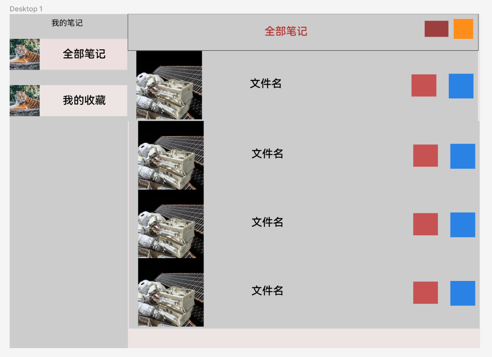
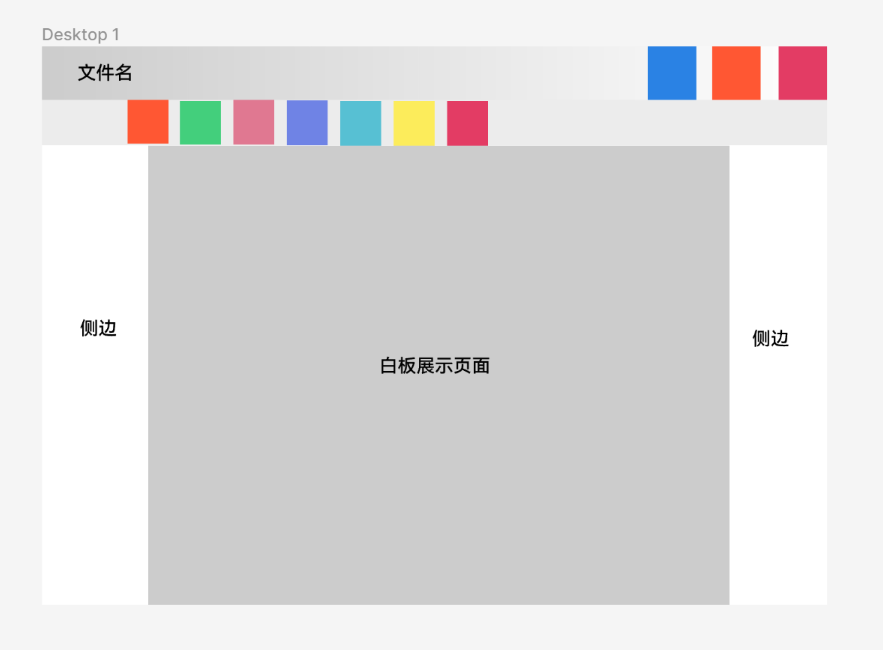

# 白板项目界面总体设计

# 书架界面设计

​​

由于我并不熟悉UI设计，所以只能大概画出这样一个UI的布局图。其实现实来说，是需要将交互的逻辑完成在设计软件中的，但由于本人此方面的软件操作以及功能了解不太深，所以这里只能给出一个简单的布局图。

所以，只能使用口头语言来描述这个界面所具有的功能和效果。

如果读者本身具有较强的UI设计能力，你完全可以设计一套自己的UI交互设计界面。

图中的彩色矩形表示将来会填充进去一些功能，比如文件名右边的红色方框（收藏功能），蓝色方框（展开一个复选框让用户选择对文件进行某些操作，比如导出、重命名、删除之类的操作）。而文件名左边的图片就是数据的封面，在用户点击文件名所在的大灰色方框之后，就会进行白板笔记编写界面（后面给出）。

全部笔记在一个顶部的工具样菜单栏一样的东西中，其右边可以添加一些比如：搜索白板笔记、设置、批量操作白板笔记等操作。

左边的是一个选择查看全部笔记还是收藏的笔记的功能，它会让右边的窗口选择展示全部笔记还是只展示用户收藏的笔迹。侧边的这些功能后续如果有时间可以进行扩展。

**对于侧边栏弹出的实现，不需要动态效果，直接使用普通的毫无动态的弹出即可。或者干脆就不做了。**

不需要多好看的效果，只需要能工作就行的软件，就是初代版应该完成的，毕竟我根本没有那么精力去将各种界面细节都设计完成。

## 结合Qt的设计

对于左边的不同按键选择，右边的显示不同的窗口，这种效果可以利用`QStackedWidget`​来实现。

而有些按键点击之后需要额外展开一个窗口来选择，就像Windows右键会展开一个框那样。这种效果可以由什么东西实现呢？依据右键弹出菜单的特性，我发现右键弹出来的是`QMenu`​。以此类推，既然右键可以弹出，那Button也可以弹出，所以该功能可能是可以利用`QPushButton`​配合`QMenu`​来进行实现！

# 白板编辑页设计

​​

顶部的是菜单栏，但又不是菜单栏，它右边具有一定数量的功能按键，都是跟具体的白板参数有关的功能选择。

顶部之下是工具栏，这个工具栏是一个悬浮窗口，它可以放在本窗口的上下左右四个区域，而彩色的部分是：撤销/恢复、钢笔、荧光笔、橡皮擦、激光笔等功能的选择处，如果用户点击一个按键，那么这个按键进入选中状态，点击处于选中状态的按键会跳出一个具体的功能选择框（只针对部分功能按键而言）。

> 但有时候弹出的功能选择框里面可能不只有`QMenu`​，我们可以还需要一个“条”，来选择笔的宽度。
>
> 用小型的颜色对话框来调整颜色，这可能需要弹出很多个框来实现，如果管理这些弹出框也是需要研究的内容。

白板展示页面用户是用户可以操作的页面。而侧边是一个空白边，只是白板在缩放过小的填充界面，我们无法再侧边上绘画，但是可以利用侧边进行翻页、或者上下一栋白板等操作。

# 关于组件交互

我们只需要关心如何将界面搭起来即可，暂时无法做到界面美观的程度，只能保证功能需要齐全。

而界面不负责处理各种复杂信号的处理，而是交由Controller来进行交互的处理。

各种功能和展现的实现其实都下方到不同的组件中，然后在Controller层，利用**中介者模式连接起来。**

这样做之后我们的组件能够最大程度的复用，但是可能会导致Controller成为一个“上帝对象”。

# 总结

白板项目界面设计的难点更多的在如何“弹出各种不同的窗口上”，如何将窗口小型化或者单纯弹出一个大窗口而不顾用户体验。

我没有办法保证自己一开始就能设计出完美的界面，所以未来的界面必须能够被替换！我在详细设计的时候必须往这方面上靠拢。

> 总之，本项目功能为先，界面次之，这只是用来锻炼白板核心功能实现的一个项目，不是我来锻炼界面UI设计的。

‍
